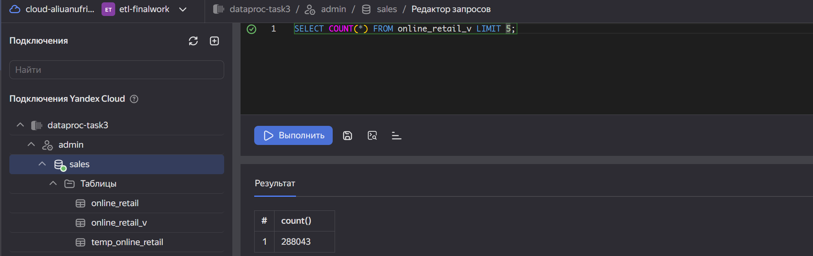
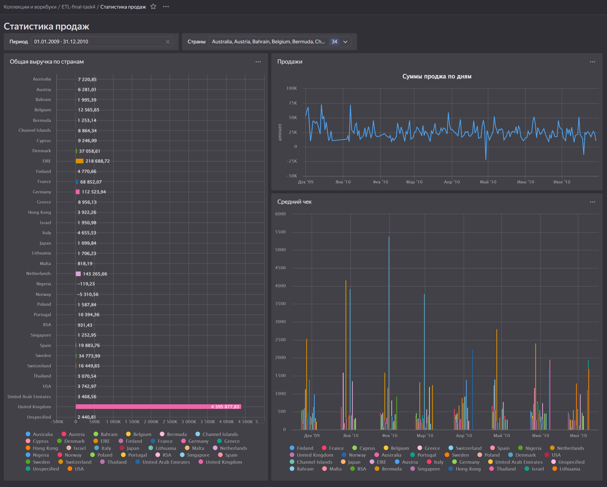
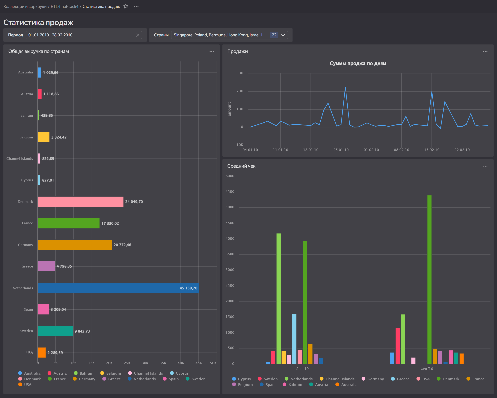

# ETL Итоговое задание

## Содержание
- [ETL Итоговое задание](#etl-итоговое-задание)
  - [Содержание](#содержание)
  - [Задание 1: Работа с Yandex Transfer](#задание-1-работа-с-yandex-transfer)
  - [Задание 2: Автоматизация работы с Yandex Data Processing при помощи Apache Airflow](#задание-2-автоматизация-работы-с-yandex-data-processing-при-помощи-apache-airflow)
  - [Задание 3: Работа с топиками Apache Kafka® с помощью PySpark-заданий в Yandex Data Processing](#задание-3-работа-с-топиками-apache-kafka-с-помощью-pyspark-заданий-в-yandex-data-processing)
  - [Задание 4: Визуализация в DataLens](#задание-4-визуализация-в-datalens)
    - [Чарты:](#чарты)
    - [Общие фильтры:](#общие-фильтры)

---

## Задание 1: Работа с Yandex Transfer

1. В консоли управления создана база данных **online_retail**.  
   [Скрипт создания](./scripts/task_1/create_table.sql)
2. В созданную таблицу загружен [датасет онлайн продаж](https://www.kaggle.com/datasets/mathchi/online-retail-ii-data-set-from-ml-repository).
3. Так как нет возможности импортировать данные с трансформацией в колонку с типом datetime, колонка с датой счета загружена в текстовом виде. Затем создана новая колонка с типом datetime, которую заполнил по исходным данным.  
   [Скрипт заполнения](./scripts/task_1/convert_date.sql)
4. Созданы эндпойнты приемника и источника:  
   
5. Создан трансфер:  
   
6. После выполнения трансфера в объектном хранилище создался файл перенесённых данных:  
   

---

## Задание 2: Автоматизация работы с Yandex Data Processing при помощи Apache Airflow

1. Создана и настроена вся инфраструктура для Managed Service for Apache Airflow в соответствии с гайдами.
2. Создан кластер Apache Airflow.
3. Создан [DAG-скрипт](./scripts/task_2/daily_convert_onlne_sales-DAG.py), который создаёт новый кластер Yandex Data Processing, запускает задание PySpark и удаляет созданный кластер.
4. Создан [скрипт задания](./scripts/task_2/convert.py), логика которого следующая:
   - Задание предполагает регулярную обработку. Файлы для обработки появляются ежедневно, имя файла содержит дату формирования.
   - Скрипт по текущей дате формирует ожидаемое имя файла, читает его, преобразует типы данных, корректно обрабатывает даты.
   - Записывает результат в бакет объектного хранилища в формате Parquet.

**Результат выполнения DAG:**

---

## Задание 3: Работа с топиками Apache Kafka® с помощью PySpark-заданий в Yandex Data Processing

1. Созданы кластеры Yandex Data Processing и Apache Kafka.
2. В качестве источника данных используется файл Parquet с онлайн-продажами:  
   [kafka-write.py](./scripts/task_3/kafka-write.py) — скрипт читает файл и порциями по 1000 записей с таймаутом 3 секунды отправляет их в топик Kafka.
3. В роли потребителя используется база данных в кластере Clickhouse. Данные из Kafka читаются с помощью ассоциированных таблиц. Созданы:
   - Таблица **online_retail** (связанная с топиком)
   - Таблица **temp_online_retail** (для хранения прочитанных данных)
   - Материализованное представление **online_retail_v**
   
   [Скрипт создания таблиц в Clickhouse](scripts/task_3/clickhouse_create_table.sql)

**Скриншоты результата:**
- Несколько строк:  
  
- Количество строк, записанное и прочитанное в Clickhouse:  
  

---

## Задание 4: Визуализация в DataLens

В DataLens создан дашборд, источником данных которого является база данных Clickhouse из третьей задачи.

### Чарты:
1. **Общая выручка по странам** — сумма продаж за выбранный период по странам.
2. **Сумма продаж по дням** — линейный график изменения суммы продаж по дням.
3. **Средний чек** — рассчитывается как SUM(quantity * price) / COUNTD(invoice) по месяцам и странам.

### Общие фильтры:
- Период сбора данных
- Страны (можно выбрать несколько)

**Скриншоты:**
- Общий вид доски без фильтров (период по умолчанию):  
  
- Доска с установленными фильтрами:  
  
