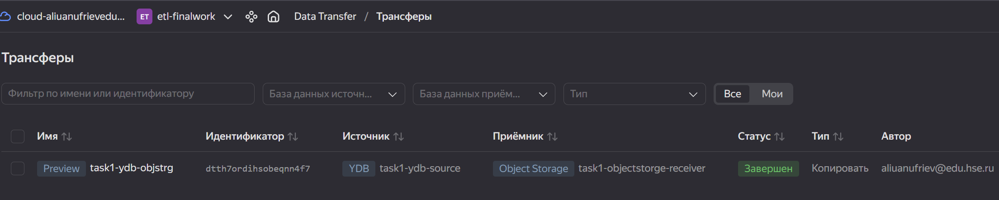

# ETL итоговое задание
## Задание 1: Работа с Yandex Transfer
1. В консоли управления создана база данных "online_retail".  
[Скрипт создания](./scripts/task_1/create_table.sql)
2. В созданную таблицу загружен [датасет онлайн продаж](https://www.kaggle.com/datasets/mathchi/online-retail-ii-data-set-from-ml-repository).
3. Так как нет возможности импортировать данные с трансформацией в колонку с типом datetime, то колонку с данными даты счета загружал в текстовом виде и затем создал нову колонку с типом datetime, которую уже заполнил по исходным данным.  
[Скрипт заполнения](./scripts/task_1/convert_date.sql)  
1. Созданы эндпойнты приемника и источника  
  
1. Создан трансфер  

1. После выполнения трансфера в объектном хранилище создался файл перенесенных данных  

## Задание 2: Автоматизация работы с Yandex Data Processing при помощи Apache AirFlow
1. Создана и настроена вся инфраструктура для Managed Service for Apache Airflow в соответствии с гайдами.
2. Создан кластер Apache Airflow.
3. Создан [DAG скрипт](./scripts/task_2/daily_convert_onlne_sales-DAG.py), который создает новый кластер yandex data processing, запускает задание pyspark и удаляет созданный кластер.
4. Создан [скрипт задания](./scripts/task_2/convert.py), логика которого следующая:  
   - Предполагается, что задание - это регулярная операция. Файлы для обработки в директории источника появляются ежедневно и наименование файла за теущий день содержит в начале имени дату формирования. Даг запускается раз в день и обрабатывает файлы за текущий день.
   - Скрипт запускается, по текущей дате формирует ожидаемое имя файла источника, читает этот файл.
   - Скрипт преобразует типы данных исходного файла. Даты заказов пытается прочитать в разных форматах, так как в исходном датасете у дней, месяцев и часов могут отстуствовть лидирующие нули.
   - Записывает файл в бакет объектного хранилища в формате parquet.
Результат выполнения дага:

## Задание 3: Работа с топиками Apache Kafka® с помощью PySpark-заданий в Yandex Data Processing
1. Созданы кластеры Yandex Data Processing и Apache Kafka.
2. В качестве источника данных используется записанный в объектное хранилище файл данных по онлайн продажам online_retail_2009_2010.parquet.  
Написан скрипт задания [kafka-write.py](./scripts/task_3/kafka-write.py). Этот скрипт читает файл источник данных и порциями по 1000 записей с таймаутом в 3 секунды отправляет их в заранее созданный топик в кафке.  
3. В роли потребителя используется заранее созданная база данных в кластере Clickhouse. Данные из кафки читаются, используя имеющуюся в Сlickhouse функцию создания ассоциированных с топиком в кафки таблиц. Для того, чтобы этот механизм работал созданы 2 таблицы **online_retail** (связанная с топиком таблица) и обычная таблица **temp_online_retail**, в которую складываются прочитанные данные. Для чтения данных создано материализованное представление **online_retail_v**. В результате данные из топика читаются в реальном времени и в автоматическом режиме.  
[Скрипт создания таблиц в Clickhouse](./scripts/task_3/kafka-write.py)
4. Скриншоты результата:  
Несколько строк:  

Количество строк, записанное и прочитанное на момент создания отчета (20% от всего объема):  
